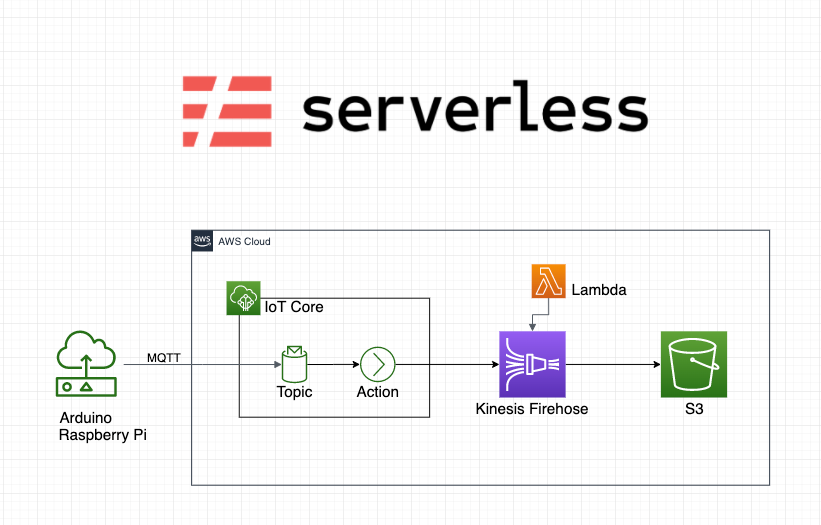

# Edge Computing POC with Raspberry Pi, ESP8266, DHT11, MQTT, and AWS IoT Core.

Edge computing is a distributed computing paradigm that brings computation and data storage closer to the edge of the network, where the data is generated. This can help to improve performance, reduce latency, and protect data privacy.

In this article, we will build an edge computing architecture using Raspberry Pi, ESP8266, DHT11, MQTT, and AWS IoT Core. The Raspberry Pi will be used as an edge device, which will be connected to an ESP8266 microcontroller. The ESP8266 will collect data from a DHT11 temperature and humidity sensor, and then publish that data to the Raspberry Pi using the MQTT protocol. The Raspberry Pi will consume the data from the ESP8266, and then stream it to AwS IoT Core.



# IoT Device Setup Guide

This guide will walk you through the process of setting up an IoT device in AWS IoT Core with the provided policies and certificates.

## Prerequisites

- AWS CLI installed and configured with your AWS account credentials.
- Node.js installed to run the AWS IoT Device SDK.
- A unique name for your IoT device (replace `{your_device_name}`).
- A unique name for your IoT thing (replace `{your_thing_name}`).

## 1. Create an IAM Policy (edgeDevicePolicy)

- Create an IAM policy named "edgeDevicePolicy" in your AWS IAM console.
- Use the following JSON as your policy document. This policy grants necessary permissions to various AWS services:

```json
{
  "Version": "2012-10-17",
  "Statement": [
    {
      "Effect": "Allow",
      "Action": [
        "greengrass:*",
        "iot:*",
        "iotanalytics:*",
        "cloud9:*",
        "lambda:*",
        "s3:*",
        "sns:*",
        "iam:*",
        "cognito-identity:*",
        "cognito-sync:*",
        "cognito-idp:*",
        "logs:*",
        "ec2:*",
        "cloudwatch:*",
        "kms:ListAliases",
        "kms:DescribeKey",
        "cloudformation:DescribeStackResources",
        "tag:getResources"
      ],
      "Resource": "*"
    }
  ]
}
```

## 2. Create a Device Folder

- In your terminal, create a folder for your IoT device. Replace `{your_device_name}` with your chosen name (e.g., DHT11):

```bash
mkdir {your_device_name} # Example: DHT11
cd DHT11
npm install aws-iot-device-sdk
```

## 3. Download the RootCA Certificate

- Download the Amazon Root CA certificate used for secure communication with AWS IoT Core:

```bash
curl https://www.amazontrust.com/repository/AmazonRootCA1.pem > certs/root-CA.crt
```

## 4. Create a Policy in IoT Core Portal (devicePolicy)

- In the AWS IoT Core portal, create a policy named "devicePolicy" with the following JSON policy document. This policy allows your IoT device to connect, publish, subscribe, and receive messages:

```json
{
  "Version": "2012-10-17",
  "Statement": [
    {
      "Effect": "Allow",
      "Action": [
        "iot:Connect",
        "iot:Publish",
        "iot:Subscribe",
        "iot:Receive",
        "greengrass:Discover"
      ],
      "Resource": ["*"]
    }
  ]
}
```

## 5. Create a Thing

- Use the AWS CLI to create a "Thing" in AWS IoT Core. Replace `{your_thing_name}` with a unique name for your IoT device (e.g., RPI_DHT11_1):

```bash
aws iot create-thing --thing-name {your_thing_name} > {your_thing_name}.json # Example: RPI_DHT11_1
```

## 6. Create Certificates

- Use the AWS CLI to create certificates and make one of them active. These certificates will be used for secure communication. The following commands will create certificate files in your device's folder:

```bash
aws iot create-keys-and-certificate --set-as-active --certificate-pem-outfile certs/certificate.pem.crt --private-key-outfile certs/private.pem.key
```

## 7. Attach Policy to Certificates

- Attach the "devicePolicy" created in step 4 to the certificates:

```bash
aws iot attach-policy --policy-name devicePolicy --target {YOUR_CERT_ARN}
```

Replace `{YOUR_CERT_ARN}` with the ARN of the certificate created in step 6.

## 8. Attach Thing Principal

- Attach your IoT device to the certificate principal:

```bash
aws iot attach-thing-principal --thing-name {your_thing_name} --principal {YOUR_CERT_ARN}
```

## 9. Get Endpoint

- Use the AWS CLI to retrieve the IoT Core endpoint:

```bash
aws iot describe-endpoint --endpoint-type iot:Data-ATS > endpoint.json
```

This saves the IoT endpoint information in an `endpoint.json` file.

Now, your IoT device is set up with the required policies, certificates, and permissions. You can use this device to connect to AWS IoT Core securely. Be sure to configure your IoT device code to use the certificates and endpoint information gathered in the previous steps for secure communication with AWS IoT Core.

You're now ready to develop and deploy your IoT device for AWS IoT Core!.
