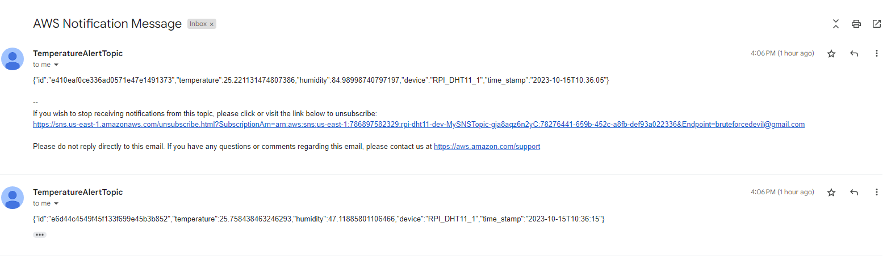

# Rpi-DHT11 AWS Serverless Application

This is a Serverless application designed to collect temperature data from a Raspberry Pi with a DHT11 sensor and store it in an AWS DynamoDB table. When the temperature exceeds a specified threshold, it triggers an alert through Amazon Simple Notification Service (SNS).

## Project Structure

The `serverless.yml` file defines the AWS resources and configurations for this application. It's organized into different sections to specify services, resources, and functions.

```yaml
org: iamjai3
app: rpi-dht11
service: rpi-dht11
frameworkVersion: '3'
```

These lines specify the organization, application, and service names. The `frameworkVersion` indicates the version of the Serverless Framework being used (version 3).

### Custom Configuration

```yaml
custom:
  tableName: 'RpiDHT11'
```

The `custom` section allows you to define custom variables. In this case, it sets a custom variable `tableName` with the value 'RpiDHT11'.

### AWS Provider Configuration

```yaml
provider:
  name: aws
  runtime: nodejs18.x
  iamRoleStatements:
    - Effect: Allow
      Action:
        - dynamodb:DescribeTable
        - dynamodb:Query
        - dynamodb:Scan
        - dynamodb:GetItem
        - dynamodb:PutItem
        - dynamodb:UpdateItem
        - dynamodb:DeleteItem
        - iot:Publish
        - sns:Publish
      Resource:
        - { 'Fn::GetAtt': ['RpiDHT11', 'Arn'] }
  environment:
    USER_TABLE: ${self:custom.tableName}
```

The `provider` section configures the AWS provider. It specifies the runtime for Lambda functions as Node.js 18.x and defines IAM role statements, which grant permissions to AWS services. It also sets an environment variable `USER_TABLE` to the custom table name.

### AWS Resources

```yaml
resources:
  Resources:
    RpiDHT11:
      Type: 'AWS::DynamoDB::Table'
      Properties:
        AttributeDefinitions:
          - AttributeName: id
            AttributeType: S
        KeySchema:
          - AttributeName: id
            KeyType: HASH
        ProvisionedThroughput:
          ReadCapacityUnits: 1
          WriteCapacityUnits: 1
        TableName: ${self:custom.tableName}
```

The `resources` section defines AWS CloudFormation resources. It creates a DynamoDB table named 'RpiDHT11' with a single primary key attribute 'id'. The provisioned throughput is set to 1 read capacity unit and 1 write capacity unit.

```yaml
MySNSTopic:
  Type: 'AWS::SNS::Topic'
  Properties:
    DisplayName: 'TemperatureAlertTopic'
```

This part creates an SNS (Simple Notification Service) topic named 'MySNSTopic' with a display name 'TemperatureAlertTopic'.

```yaml
MySNSSubscription:
  Type: 'AWS::SNS::Subscription'
  Properties:
    Endpoint: '' # Replace with your email or phone number
    Protocol: 'email' # Change to 'sms' for text messages
    TopicArn: { Ref: 'MySNSTopic' }
```

An SNS subscription is defined to send notifications to the specified endpoint, in this case, an email address. You can change the `Endpoint` and `Protocol` to match your desired notification method.

```yaml
MyIoTRuleRole:
  Type: 'AWS::IAM::Role'
  Properties:
    RoleName: 'YourIoTRuleRole'
    AssumeRolePolicyDocument:
      Version: '2012-10-17'
      Statement:
        - Effect: 'Allow'
          Principal:
            Service: 'iot.amazonaws.com'
          Action: 'sts:AssumeRole'
```

This section creates an IAM role for IoT (Internet of Things) rules. It specifies the role's name and defines a policy document that allows IoT to assume this role.

```yaml
MyIoTRule:
  Type: 'AWS::IoT::TopicRule'
  Properties:
    RuleName: 'TemperatureRule'
    TopicRulePayload:
      Description: 'Rule to trigger SNS when temperature is greater than 18'
      Sql: "SELECT * FROM 'device/dht11' WHERE temperature > 18"
      Actions:
        - Sns:
            TargetArn: { Ref: 'MySNSTopic' }
            RoleArn: { Fn::GetAtt: [MyIoTRuleRole, Arn] }
```

This part creates an IoT rule named 'TemperatureRule.' The rule's SQL query selects messages from a topic and checks if the temperature is greater than 18. If true, it triggers an SNS action, sending a notification to the 'MySNSTopic.' It also specifies the role to be assumed when executing this rule.

_Sample Email Response:_


### Lambda Function

```yaml
functions:
  rpiDth11Handler:
    handler: index.handler
    events:
      - iot:
          sql: "SELECT * FROM 'device/dht11'"
          sqlVersion: '2016-03-23'
```

This defines a Lambda function named 'rpiDth11Handler,' which is responsible for handling temperature data. It specifies the entry point (`handler` in the `index` file) and the event that triggers the function. In this case, it's triggered by IoT messages with a specific SQL query.

## Conclusion

This Serverless application sets up infrastructure to collect and process temperature data from a Raspberry Pi using a DHT11 sensor. It stores the data in DynamoDB, and when the temperature exceeds 18, it triggers an alert through SNS. It uses IoT rules to filter messages and Lambda functions to process them. You can further customize and extend this application to meet your specific requirements.
